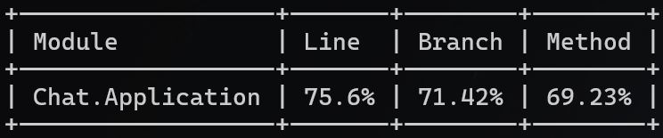

## Overview

Website offers chat rooms with various topics for communication. Users can be anonymous or they can register and log in. The color of the messages indicates their sentiment.

- Green message - positive sentiment
- Blue message - neutral sentiment
- Orange message - negative sentiment

The user can register on the site:

And then log in:

The header will be changed: 

## Application structure

**Onion Architecture** was chosen because it promotes separation of concerns, ensuring that core business logic is independent of external frameworks and technologies. This makes the application more maintainable, testable, and flexible to changes in infrastructure or external dependencies.

- src:
  - backend:
    - **Chat.Domain** - Domain layer. Contains entities and repository interfaces.
    - **Chat.Application** - Application layer. Contains services, dtos, validators.
    - **Chat.Infrastructure** - Infrastructure Layer. Contains implementations to external resources (Auth and Azure Sentiment Text Analysis). Contains repository implementations.
    - **Chat.Api** - ASP.NET Core Web Api project. Uses minimal api. Сontains endpoints. 
  - frontend:
    - **Chat.Web** - Blazor WASM project. Сontains page components and all web related things.
  - shared:
    - **Chat.Common** - Shared resources. Contains requests and responses.
- tests:
  - **Chat.Application.UnitTests** - Unit tests for services.

## Technology stack

Main:
  - ASP.NET Core - Backend framework.
  - Blazor WASM - Frontend framework.
  - SQL Server - Application database.
  - EF Core - ORM framework for database interaction.
  - Microsoft.Azure.SignalR - SignalR service for real-time communication.
  - Microsoft.AspNetCore.SignalR.Client - SignalR interaction on the client side.
  - Microsoft.AspNetCore.Authentication.JwtBearer - JWT authentication library.
  - Microsoft.AspNetCore.OpenApi - OpenAPI documentation library.
  - Azure.AI.TextAnalytics - Sentiment analysis integration.

Additional:
- FluentValidation - Validation library.  
  *Chosen* for its ergonomic way of writing validation rules.
    
- FluentResult - Library that implements result pattern.  
  *Chosen* for handling errors related to validation or business rules, as exceptions are more appropriate for unexpected internal failures.
    
- Asp.Versioning.Http - Api versioning library.  
  *Chosen* for its flexibility in configuring versioning.
    
- Scalar.AspNetCore - UI for OpenApi specification.  
  *Chosen* as an alternative to Swagger UI because it looks better (IMHO).
    
- Blazored.LocalStorage - LocalStorage library for Blazor.  
  *Chosen* for its straightforward integration with local storage.

Libraries(tests):
- XUnit - Test framework.
- NSubstitute - Mocking library.
- AwesomeAssertions - Fork of FluentAssertions under a free license.
- Coverlet.msbuild - Code coverage library.

## Code coverage

**Chat.Application.UnitTests** contains a code coverage file - *coverage.cobertura.xml*.
  
Code coverage results:
 
